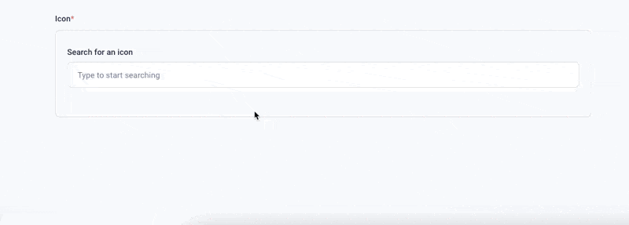
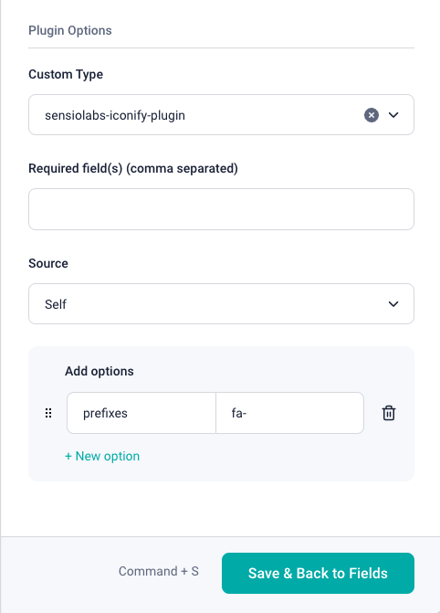

# sensiolabs-iconify-plugin



This project was created using Vue 3 and TypeScript. It consists of a set of base functionalities, such as value updating, modal toggling, and asset selection. This starter is intended to help developers when creating their own Storyblok Field Plugin.

## Table of Contents

- [Introduction](#introduction)
- [Installation](#installation)
- [Usage](#usage)
- [Configuration](#configuration)
- [Design System](#design-system)
- [Development](#development)
- [Contributing](#contributing)
- [License](#license)

## Introduction

The Storyblok Vue 3 Field Plugin provides a foundational setup for building custom field plugins for Storyblok. Leveraging Vue 3 and TypeScript, it offers a range of base functionalities to streamline the development process.

## Installation

To get started with the plugin, clone the repository and install the dependencies:

```bash
git clone https://github.com/sensiolabs-de/storyblok-plugins.git
```

You have to create a `.env` file in the root of this repository like the following:

```text
STORYBLOK_PERSONAL_ACCESS_TOKEN=xxxxxxxx
```

Now you are able to deploy this plugin to your workspace:

```bash
npm run deploy --workspace=sensiolabs-iconify-plugin
```

## Configuration

The plugin includes integration with [iconify.design](https://iconify.design/), allowing you to search for and use a wide range of icons. You can configure icon sets with specific prefixes to restrict the icons available for selection.

### Setting Icon Prefixes

To restrict icon sets, add the `prefixes` configuration as a comma-separated list. For example:

```json
{
  "prefixes": "fa-,mdi-"
}
```



This configuration ensures that only icons with the specified prefixes (e.g., FontAwesome and Material Design Icons) are available.

## Design System

This project utilizes the [blok.ink](https://www.storyblok.com/docs/guide/in-depth/design-system) design system provided by Storyblok. The design system allows developers to create integrated experiences that align with Storyblok's overall design aesthetic.

## Development

To develop and test your custom plugin, follow these steps:

1. Clone the repository and navigate to the project directory.
2. Install the dependencies using `npm install`.
3. Start the development server using `npm run serve`.
4. Make changes to the plugin and see the updates in real-time.

### Available Scripts

- `npm run serve`: Starts the development server.

## Contributing

Contributions are welcome! If you have any ideas, suggestions, or issues, please feel free to submit a pull request or open an issue on the repository.

1. Fork the repository.
2. Create a new branch for your feature or bugfix.
3. Commit your changes and push the branch.
4. Submit a pull request with a detailed description of your changes.

## License

This project is licensed under the MIT License. See the [LICENSE](LICENSE) file for more details.
